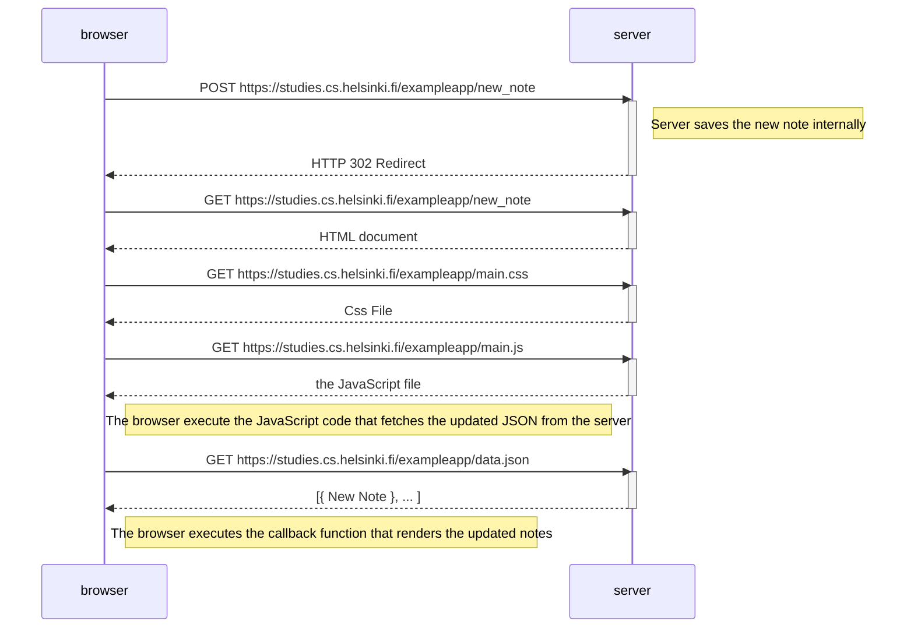

### Sequence Diagram displaying the browser and server step by step behavior when a user creates a new note on [this](https://studies.cs.helsinki.fi/exampleapp/notes) website.
---

```mermaid
sequenceDiagram

participant browser
participant server

browser->>server: POST https://studies.cs.helsinki.fi/exampleapp/new_note
activate server
Note right of server: Server saves the new note internally
server-->>browser: HTTP 302 Redirect
deactivate server

browser->>server: GET https://studies.cs.helsinki.fi/exampleapp/new_note
activate server
server-->>browser: HTML document
deactivate server

browser->>server: GET https://studies.cs.helsinki.fi/exampleapp/main.css
activate server
server-->>browser: Css File
deactivate server

browser->>server: GET https://studies.cs.helsinki.fi/exampleapp/main.js
activate server
server-->>browser: the JavaScript file
deactivate server

Note right of browser: The browser execute the JavaScript code that fetches the updated JSON from the server

 browser->>server: GET https://studies.cs.helsinki.fi/exampleapp/data.json
 activate server
server-->>browser: [{ New Note }, ... ]
deactivate server


Note right of browser: The browser executes the callback function that renders the updated notes
```