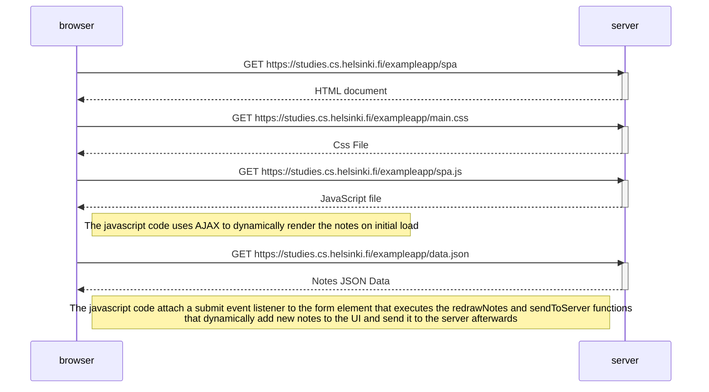

### Sequence Diagram displaying the browser and server step-by-step behavior of initial load on [this](https://studies.cs.helsinki.fi/exampleapp/spa) website.

---

```mermaid
sequenceDiagram

participant browser
participant server


browser->>server: GET https://studies.cs.helsinki.fi/exampleapp/spa
activate server
server-->>browser: HTML document
deactivate server

browser->>server: GET https://studies.cs.helsinki.fi/exampleapp/main.css
activate server
server-->>browser: Css File
deactivate server

browser->>server: GET https://studies.cs.helsinki.fi/exampleapp/spa.js
activate server
server-->>browser: JavaScript file
deactivate server

Note right of browser: The javascript code uses AJAX to dynamically render the notes on initial load

browser->>server: GET https://studies.cs.helsinki.fi/exampleapp/data.json
activate server
server-->>browser: Notes JSON Data
deactivate server

Note right of browser: The javascript code attach a submit event listener to the form element that executes the redrawNotes and sendToServer functions<br>that dynamically add new notes to the UI and send it to the server afterwards


```