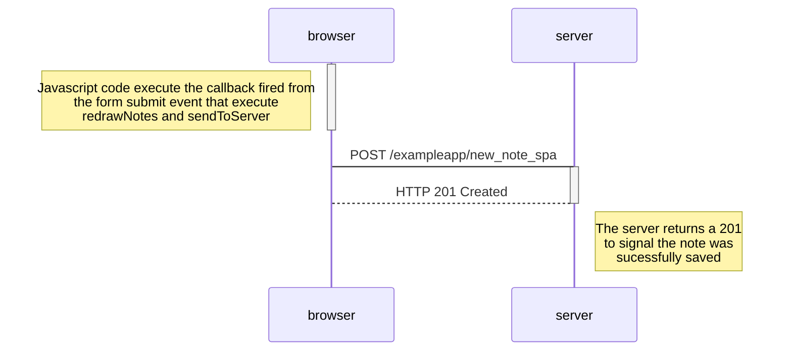

### Sequence Diagram displaying the browser and server step-by-step behavior of creating a new note on [this](https://studies.cs.helsinki.fi/exampleapp/spa) website.

---

```mermaid
sequenceDiagram
    participant browser
    participant server

    activate browser
    Note left of browser: Javascript code execute the callback fired from<br>the form submit event that execute <br>redrawNotes and sendToServer
    deactivate browser


    browser -> server: POST /exampleapp/new_note_spa
    activate server
    server --> browser: HTTP 201 Created
    deactivate server

    Note right of server: The server returns a 201<br>to signal the note was<br>sucessfully saved
```
